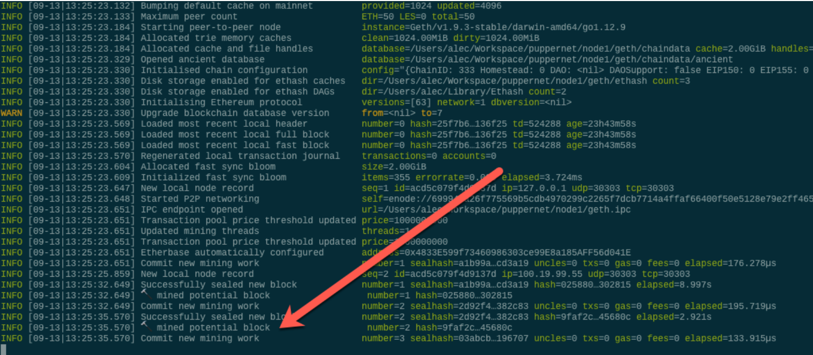
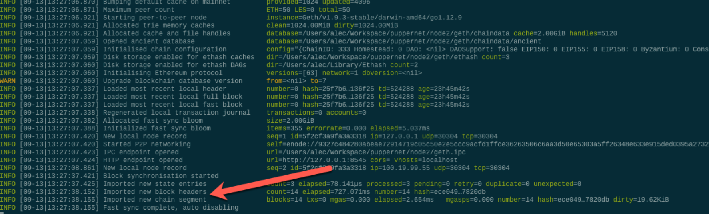
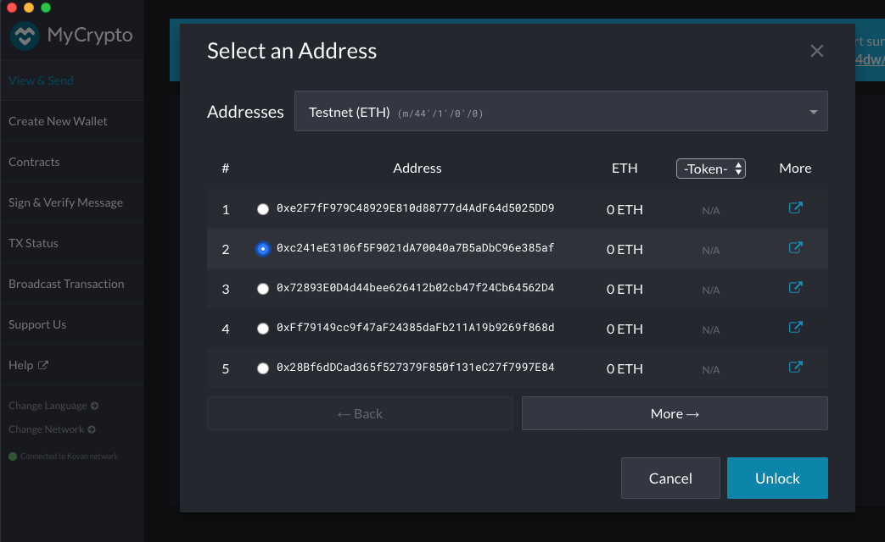
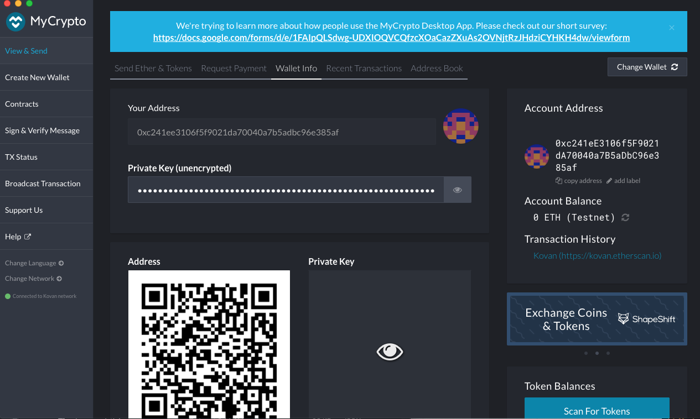
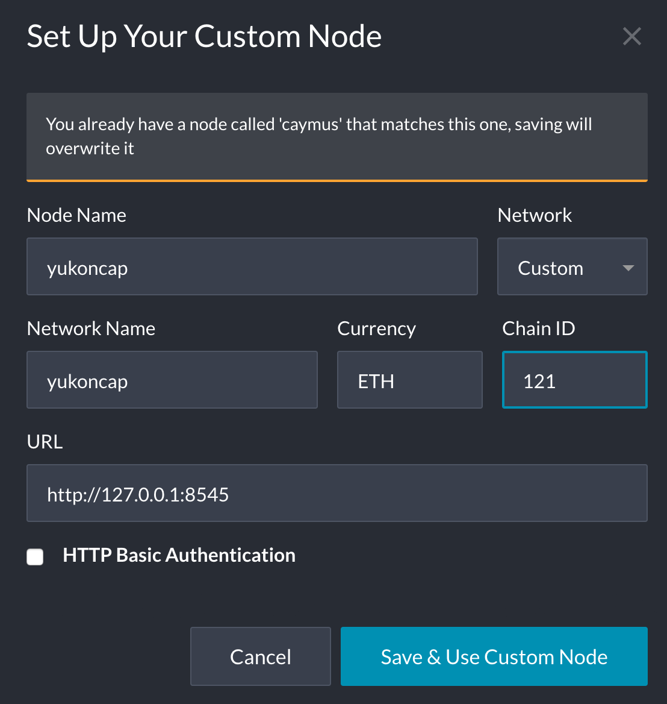
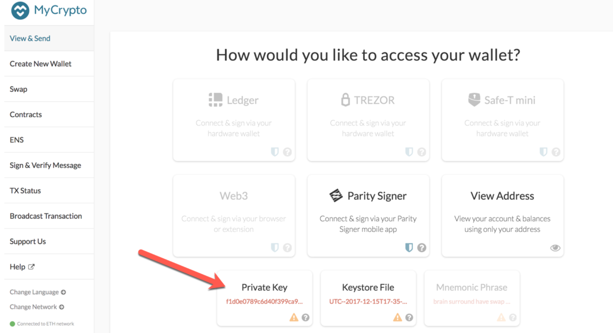
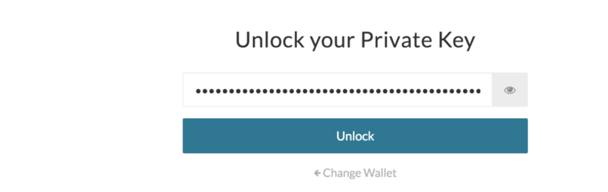
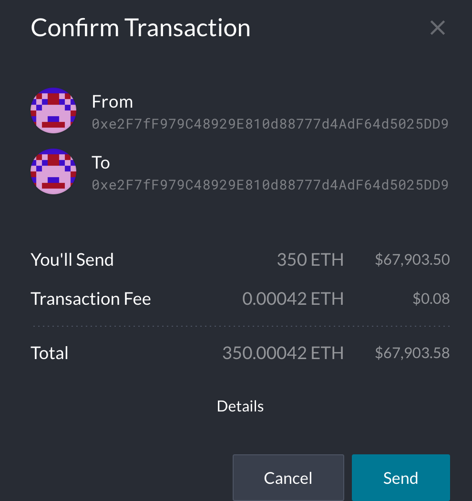
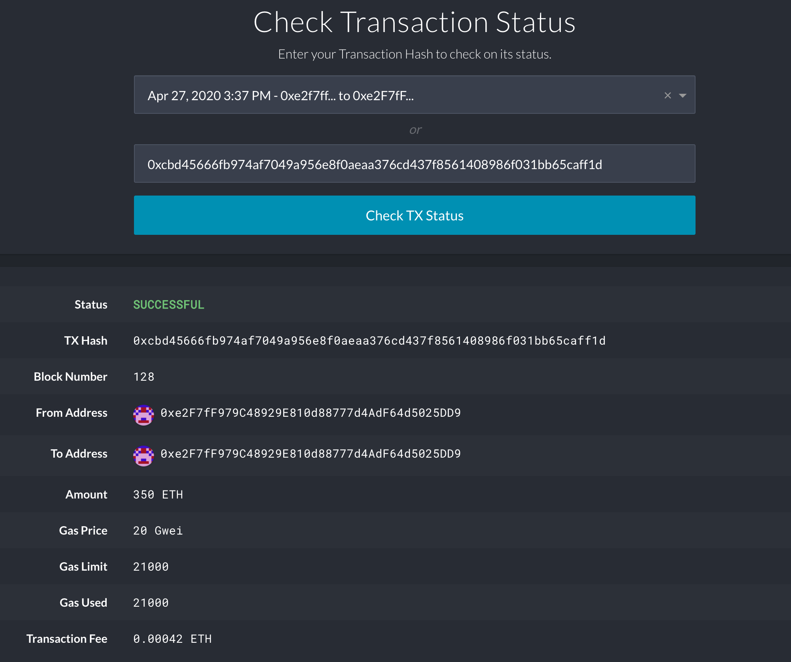

## *Z-Bank* - "Financial Engineering Our Way Into The Future"

#### Setup Guide for Z-Bank Blockchain Connection 

##### __*Guidelines for BlockChain Creation*__
  1. Generate Genesis Block Creation
  2. Creation of Account Nodes
  3. Account Node Mining ***(Bringing Yukon Capital Blockchain To Life)***
  4. Generating a transaction via Ether
  
### __Genesis Block Creation__

The ***Genesis*** block is the first block in any blockchain-based protocol. It is the foundation on which additional blocks are sequentially added to form a chain of blocks, resulting in the term, blockchain being coined.  Below is Z-Bank's genesis block creation coined ***Yukon Capital*** after our asset managment firm. 

### __Creation of Account Nodes__
The account ***Nodes*** form the infrastructure of a blockchain.  All nodes on a blockchain are connected to each other.  In this case we have created two nodes for our firm.  ***Node1*** and ***Node2***.  ***For reference only***, Nodes are created and then must be initiated by the following steps:
__**Node Creation**__
  1. ./geth account new --datadir node1
  2. ./geth account new --datadir node2
__**Node Initiation**__
  1. ./geth init yournetworkname.json --datadir node1
  2. ./geth init yournetworkname.json --datadir node2
  
  
  
  
### __Bringing Yukon Capital Blockchain To Life__
  * Node1 will be a full node that is also mining
  * Node2 will be a full node that exposes an RPC port, allowing you to talk to Node1 and **MyCrypto**
  
#### __Team Instructions for Initiating The Nodes__

  1. Open a terminal window to initiate node1.  **Note** Navigate to the *Blockchain-Yukon-Capital* Directory before initiating.
__**Starting Node1**__

  2. ./geth --datadir node1 --mine --minerthreads 1 **Run This Code** (You should see node committing new mining work.)
      * The **mine** flag tells the node to mine new blocks
      * The **--minerthreads** flag tells the geth how many CPU "workers" to use duiring mining.

__**Starting Node2**__

  3. Open a new terminal window to initiate node2. **Note** Navigate to the *Blockchain-Yukon-Capital* Directory before initiating.
  
4. **Run This Code Below**

###### ./geth --datadir node2 --port 30304 --rpc --bootnodes "enode://24608d3a91f3f3c540aa1c4bac65b5ad597e8b1824dcebbcad24167a38b125e7c366157131987840d95c2ec06b1cb16f3553c9d93963fa75a5ddb14eec3071c7@127.0.0.1:30303"  

   * The **--rpc** flag enables us to talk to our second node, which allows us to use **MyCrypto** to transact on our chain.
   * Since the first node sync port already took up 30303, we need to change this one to 303004 using **--port**
   * The **--bootnodes** flag allows you to pass teh network info needed to find other nodes in the blockchain and allows us to connect both nodes (Node1 + Node2). 

### Generating A Transaction

  1. Open up MyCrypto to get the private key of the ETH (Be Sure the Kovan network is selected)
  2. ETH Address: **0xc241eE3106f5F9021dA70040a7B5aDbC96e385af**. *Select 2 which is our address*

  3. "Select" dropdown list, and choose "Wallet Info"
  4. Click on the eye icon next to the "Private Key" field, and copy and past the private key of the wallet.
  
 
  
  ***Never Release The Private Key Information***
  
  5. I created a custom node for Yukon Capital - ***Change Network*** On bottom left to yukoncap

  6. The URL is pointing to the default RPC port on your local computer.  http://127.0.0.1:8545
  
  7. On the left pane after ensuring you are connected to the ***yukoncap*** custom node, click "View & Send"
  
  8. Click on the ***Private Key*** submit key information and hit ***Unlock***

  9. Copy The Pre-Funded Address into "To Address" Field and send a test amount. This will bring you to confirm 
  

  10. Finally Click on the ***Check TX Status***
  
  
  
 ### Congratulations on Completing your first Transaction!!!  
 
 # Z-Bank is leading the future of financial transactions
  
 
  
  
