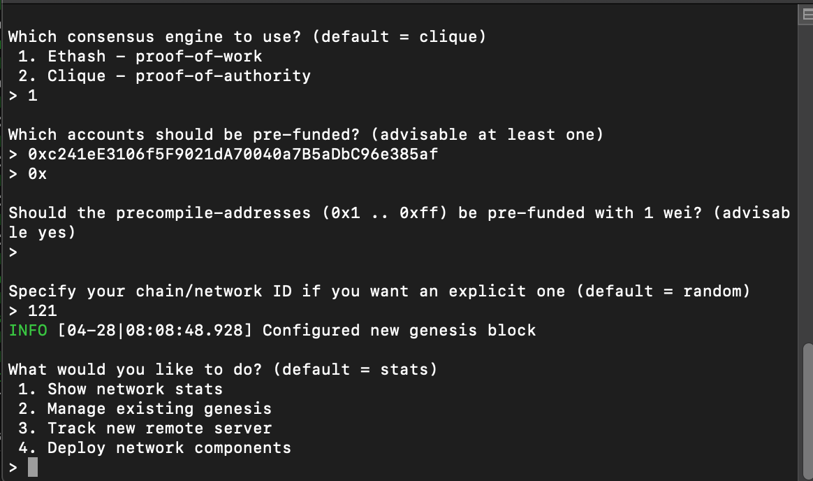
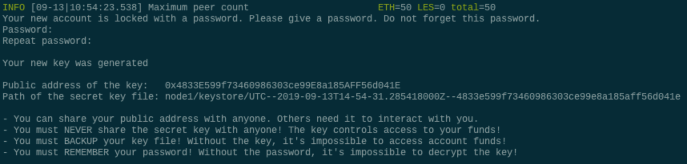

## *Z-Bank* - "Financial Engineering Our Way Into The Future"

#### Setup Guide for Z-Bank Blockchain Connection 

##### __*Guidelines for BlockChain Creation*__
  1. Generate Genesis Block Creation
  2. Creation of Account Nodes
  3. Account Node Mining 
  4. Generating a transaction via Ether
  
### __Genesis Block Creation__

The ***Genesis*** block is the first block in any blockchain-based protocol. It is the foundation on which additional blocks are sequentially added to form a chain of blocks, resulting in the term, blockchain being coined.  Below is Z-Bank's genesis block creation coined ***Yukon Capital*** after our asset managment firm. 

### __Creation of Account Nodes__
The account ***Nodes*** form the infrastructure of a blockchain.  All nodes on a blockchain are connected to each other.  In this case we have created two nodes for our firm.  ***Node1*** and ***Node2***.  ***For reference only***, Nodes are created and then must be initiated by the following steps.
  1. ./geth account new --datadir node1
  2. ./geth account new --datadir node2
  
  
